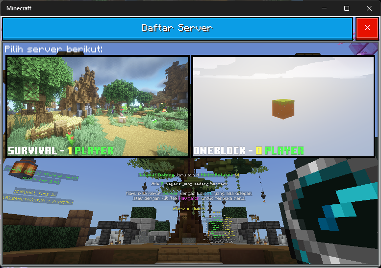

# Global Update

_13 Mei 2025_

---

## Penambahan

- (Bedrock) UI selector Lobby menggunakan form custom.

  

## Perubahan

- (Bedrock) Warna dari Locator bar bergantung pada warna "rambut" player. Jika warnanya gelap, akan dibuat sedikit lebih cerah.
- Max player per ip sekarang 6 (sebelumnya 3).

## Perbaikan

- (Bedrock) Tidak bisa mengambil napas saat berenang di permukaan air.
- (Bedrock) Dapat melakukan sprint di permukaan air.
- (Bedrock) Dapat melakukan glide saat di dalam air.
- (Bedrock) Player dengan touch control tidak dapat turun di dalam scaffolding.
- (Bedrock) State lompat dan jongkok tidak terbaca jika berubah tanpa input user.
- (Bedrock) UI dengan title yang berisi tanda hubung akan berubah menjadi UI selector Lobby.