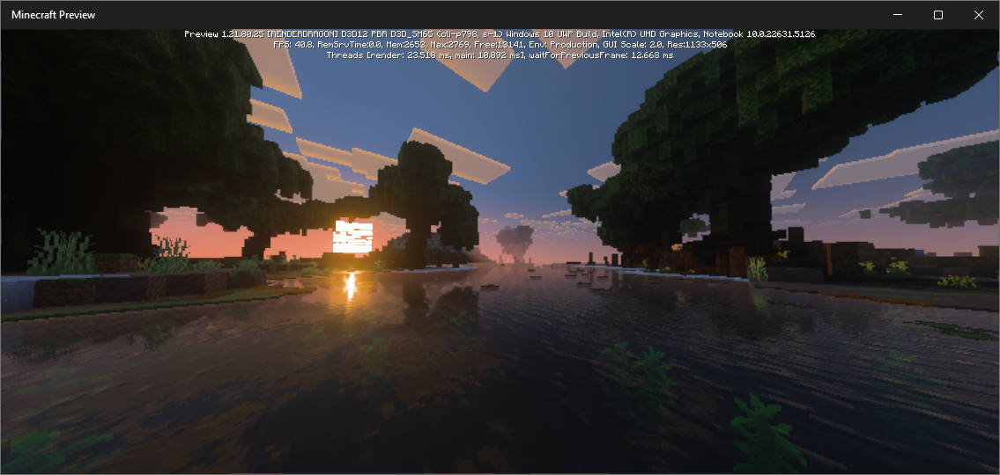
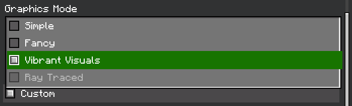
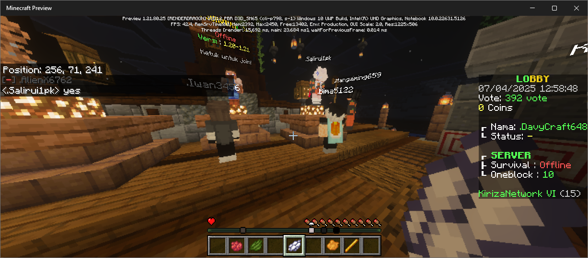
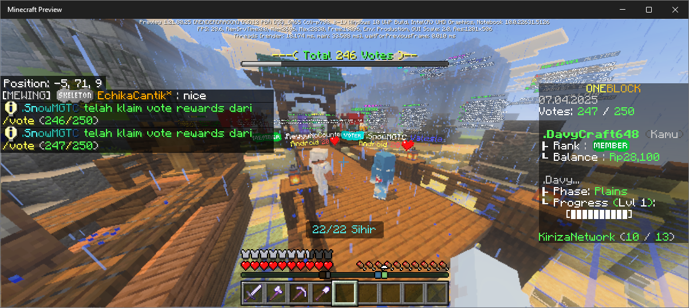

# Version Update

_06 April 2025_

---
Server kini mendukung **Minecraft Bedrock Beta & Preview** `1.21.80.25`.

### Penambahan

- Dukungan untuk Minecraft Bedrock Beta & Preview versi 1.21.80.25.

  
- Fitur experimental "[Vibrant Visuals](https://www.minecraft.net/en-us/article/minecraft-vibrant-visuals)" yang dapat diakses oleh player Minecraft Bedrock Beta & Preview 1.21.80.25.

  
- Fitur experimental "[Player locator bar](https://www.minecraft.net/en-us/article/test-the-new-player-locator-bar)" yang dapat diakses oleh player Minecraft Bedrock Beta & Preview 1.21.80.25.

  
  

### Perbaikan

- Skin dari player dan block custom player head memperlihatkan skin default (steve) bagi player Minecraft Bedrock
  Preview.

  

## Versi yang didukung di server sekarang:

* **Minecraft Bedrock Edition**

  | Protocol | Minecraft Release                               | Minecraft Beta/Preview                |
  |----------|-------------------------------------------------|---------------------------------------|
  | 685      | 1.21.0, 1.21.1                                  | 1.21.0.24, 1.21.0.25, 1.21.0.26       |
  | 686      | 1.21.2, 1.21.3_PS                               | -                                     |
  | 712      | 1.21.20, 1.21.21, 1.21.22, 1.21.23              | 1.21.20.22, 1.21.20.23, 1.21.20.24    |
  | 729      | 1.21.30, 1.21.31                                | 1.21.30.24, 1.21.30.25                |
  | 748      | 1.21.40, 1.21.41, 1.21.42_PS5, 1.21.43, 1.21.44 | 1.21.40.23, 1.21.40.25                |
  | 766      | 1.21.50, 1.21.51                                | 1.21.50.28, 1.21.50.29, 1.21.50.30_PS |
  | 776      | 1.21.60, 1.21.61, 1.21.62                       | 1.21.60.25, 1.21.60.27, 1.21.60.28    |
  | 786      | 1.21.70, 1.21.71                                | 1.21.70.25, 1.21.70.26                |
  | 798      | -                                               | **1.21.80.25**                        |
* **Minecraft Java Edition/Pojav**
  - 1.20, 1.20.1, 1.20.2
  - 1.20.3, 1.20.4
  - 1.20.5, 1.20.6
  - 1.21, 1.21.1
  - 1.21.2, 1.21.3
  - 1.21.4
  - 1.21.5